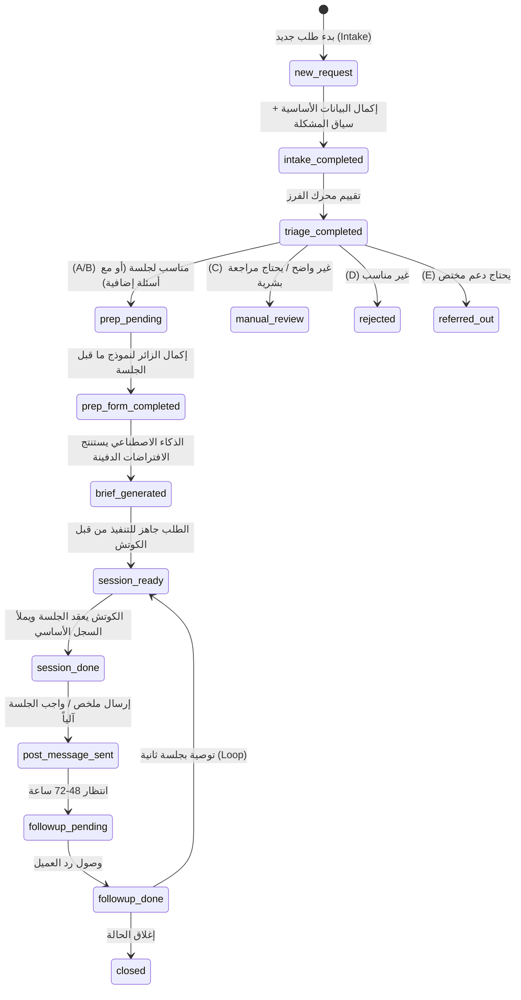

# Session OS: Implementation Plan (PRD)

> [!IMPORTANT]
> هذا المخطط هو ترجمة المعمار الكامل لنظام الجلسات (Session OS) إلى متطلبات تقنية وقاعدة بيانات قابلة للتنفيذ مباشرة على منصة الرحلة، بناءً على القواعد والأهداف المحددة. لا يتضمن النظام وعوداً بمواعيد فورية، وتم تصميمه ليكون أداة فرز وتحضير ذكية تخدم المالك وتوجه العميل.

## 1. نظرة عامة (Overview)

الهدف هو بناء نظام متكامل لإدارة تدفق الجلسات (Session Journey Flow) الذي يحول "طلب الحجز" إلى عملية ممنهجة تشمل: طلب → فرز (Triage) → تجهيز (Prep) → تنفيذ (Session) → توثيق (Record) → متابعة (Follow-up).

يتكون النظام من 6 باقات أساسية (Modules):
1. **Intake Module:** استقبال البيانات الأساسية وسبب الطلب.
2. **Triage Module:** محرك اتخاذ القرار والفرز.
3. **Pre-Session Module:** نموذج ما قبل الجلسة (لتجميع التفاصيل).
4. **Coach Console:** شاشات داخلية للكوتش (المالك) لإدارة التفريغ وإعادة الصياغة.
5. **Post-Session Module:** التوثيق والرسائل الآلية.
6. **Follow-Up Module:** المتابعة بعد 48/72 ساعة واتخاذ قرار الإغلاق أو الاستكمال.

---

## 2. الستيتس ماشين (User Flow & State Machine)

تتغير حالة طلب الجلسة `session_requests.status` عبر المسار التالي:

---

## 3. هندسة البيانات (Database Schema)

للحفاظ على نظافة النظام، سيتم فصل الكيانات إلى الجداول التالية والتي سيتم إضافتها عبر ملف Migration:

### 1) جدول العملاء `therapy_clients` (أو `sessions_clients`)
* `id` (UUID, PK)
* `name` (Text)
* `phone` (Text)
* `email` (Text)
* `country` (Text)
* `age_range` (Text)
* `preferred_contact` (Text - WhatsApp, Phone, etc)
* `created_at` (Timestamp)

### 2) جدول الطلبات `session_requests`
* `id` (UUID, PK)
* `client_id` (FK -> clients)
* `source` (Text)
* `status` (Enum: `new_request`, `intake_completed`, `triage_completed`, `prep_pending`, `prep_form_completed`, `brief_generated`, `session_ready`, `session_done`, `post_message_sent`, `followup_pending`, `followup_done`, `closed`, `rejected`, `referred_out`, `needs_manual_review`, `abandoned`)
* `created_at` (Timestamp)

### 3) جدول الفرز `triage_answers`
* `request_id` (FK -> session_requests, PK)
* `urgency_score` (Int)
* `clarity_score` (Int)
* `readiness_score` (Int)
* `complexity_score` (Int)
* `risk_flags` (JSONB - Array of flags)

### 4) جدول التجهيز `prep_forms`
* `request_id` (FK -> session_requests, PK)
* `story` (Text)
* `attempts_before` (Text)
* `current_impact` (Text array / JSONB)
* `desired_outcome` (Text)
* `dominant_emotions` (Text array / JSONB)

### 5) الذكاء الاصطناعي `ai_session_briefs`
* `request_id` (FK -> session_requests, PK)
* `visible_problem` (Text)
* `emotional_signal` (Text)
* `hidden_need` (Text)
* `expected_goal` (Text)
* `first_hypothesis` (Text)
* `session_boundaries` (Text)

### 6) الجلسات الفعلية `sessions`
* `id` (UUID, PK)
* `request_id` (FK -> session_requests)
* `started_at` (Timestamp)
* `ended_at` (Timestamp)
* `coach_notes` (Text)
* `status` (Enum: `completed`, `missed`, `postponed`)

### 7) ملخصات الجلسة `session_summaries`
* `session_id` (FK -> sessions, PK)
* `main_topic` (Text)
* `dominant_pattern` (Text)
* `hidden_need` (Text)
* `main_intervention` (Text)
* `assignment` (Text) -- الواجب العملي
* `deadline` (Timestamp)
* `client_rating` (Int)
* `coach_internal_rating` (Int)
* `compliance_expectation` (Text)
* `followup_needed` (Boolean)
* `second_session_recommended` (Boolean)
* `recommendation_reason` (Text)

### 8) المتابعة `followups`
* `id` (UUID, PK)
* `session_id` (FK -> sessions)
* `scheduled_for` (Timestamp)
* `status` (Enum: `pending`, `sent`, `replied`, `closed`)
* `client_reply` (Text)
* `next_action` (Text)

---

## 4. مسارات الشاشات والمنطق (App Architecture & Logic)

سيتم بناء هذا النظام داخل توجيه (Routing) معزول ضمن App Router، مع فصل شاشات العميل (يُمكن الوصول لها كـ public أو user mode) عن شاشات المالك (admin).

### أ- مسار العميل (Client Facing) - `/sessions/intake`

> [!NOTE]
> لا يوجد أي حقل لـ "اختيار موعد". الهدف هو "تقديم طلب للمراجعة".

#### شاشة Entry (شاشة الدخول):
* **CTA:** لبدء طلب جلسة، ادخل على منصة الرحلة واملأ الخطوات التالية... 
* يعرض سياسة الاستخدام (لا طوارئ، فرز مبدئي وغيرها).

#### شاشة 1: البيانات الأساسية (Basic Info)
* الاسم، رقم الموبايل/واتساب، البريد، البلد، السن، وسيلة التواصل.

#### شاشة 2: سبب الطلب (Reason & Urgency)
* حابب الجلسة تكون عن إيه؟ (Textarea)
* ليه دلوقتي؟ (يكشف الاستعجال)
* أكتر حاجة مضايقاك؟

#### شاشة 3: سياق مختصر (Context)
* هل أخذ جلسات قبل كده؟ (خيارات).
* طرف / موقف محدد؟
* درجة التأثير (1-10) ومقدار الوقت.

#### شاشة 4: حدود الأمان (Safety Gates - **مهم جداً**)
* أسئلة أمان وتوضيح هدف الجلسة (وضوح، قرار، فهم نمط.. الخ). **إذا اختار العميل أزمة حرجة/طوارئ، النظام بيفعل الـ Risk Flag**.

#### Triage Engine (تتم في الخلفية):
* يقوم السيرفر بجمع البيانات، إعطاء Scores وحساب حالة التوجيه. 
* يتم تحويل المستخدم المقبول لشاشة `Prep-Form` (أو لاحقاً لو طلبنا منه يكمل). أو يُرسل رسالة "تم استلام الطلب".

#### مسار التجهيز (Prep Form) - لم يتم قبوله للخطوة التالية:
* القصة المختصرة؟ ما تم تجربته؟ الأثر الحالي مسيطر على إيه؟ النتيجة المطلوبة؟

### ب- مسار الكوتش/المالك (Admin / Coach Console) - `/admin/sessions`

> [!TIP]
> هذه الشاشات مصممة للحفاظ على تركيز المالك كـ Console متكامل للعمل.

#### 1. لوحة المهام (Dashboard):
* عرض الطلبات مقسمة حسب (جديدة / تحتاج مراجعة / جاهزة للجلسة / جلسات تمت / متابعات معلقة).

#### 2. بطاقة الذكاء الاصطناعي (AI Session Brief):
* قبل الجلسة يرى المالك: المشكلة الظاهرة، الإشارة العاطفية، الاحتياج الدفين، الفرضية، وحدود الجلسة (AI Extraction from Intake + Prep).

#### 3. كونسول الجلسة (Live Session Console):
* افتتاح الجلسة (هدف الجلسة في جملة).
* التفريغ المنظم (What, When, Who?).
* فصل الطبقات (وقائع، تفسير، إحساس، سلوك).
* كشف النمط (تجنب، استرضاء، إلخ).
* إعادة صياغة (Reframing).
* الإجراء (Action 24-72h).

#### 4. شاشة الإغلاق والتوثيق (Closing & Post-Session):
* إدخال الـ Summary: الفهم، الاكتشاف، المطلوب، المتابعة.
* يولد النظام الـ Session Record ويفعل رسالة شكر (Post-Session Message Automation).

#### 5. مركز المتابعة (Follow-up Center):
* الردود الآلية للعملاء بخصوص الواجب (تم، جزء، لم يتم).
* يقرر بناءً عليها المالك (أو السيستم) خطوة الإغلاق أو الجلسة الثانية.

---

## 5. خطة التنفيذ (Execution Steps)

1. **Phase 1: Database Migration**
   * إنشاء جدول الـ Tables المذكورة وضبط الروابط (FK) والـ Enums الأساسية بحسب المعمار.
2. **Phase 2: Client Intake Flow (UI + API)**
   * بناء شاشات العميل من الدخول حتى أسئلة الأمان وجمع الـ Triage Score و حفظها في قاعدة البيانات.
3. **Phase 3: Automation & Logic**
   * بناء الـ Triage Logic Engine (لتصنيف العميل) وربطه باختبارات الأمان.
   * إرسال البيانات للذكاء الاصطناعي لاستخراج الـ Brief الداخلي.
4. **Phase 4: Admin Console UI**
   * بناء شاشات الأونر: الـ Dashboard، الـ Session Console التفاعلي أثناء الجلسة، وشاشة توثيق الإغلاق.
5. **Phase 5: Notification & Follow Up System**
   * رسائل ما بعد الجلسة وجدولة المتابعات.

> [!CAUTION]
> الرجاء مراجعة هذا المخطط لإبداء أي تعديلات قبل البدء بصياغة ملف الـ Migration الخاص بقواعد البيانات والبدء في تنفيذ الـ Phase 1.
