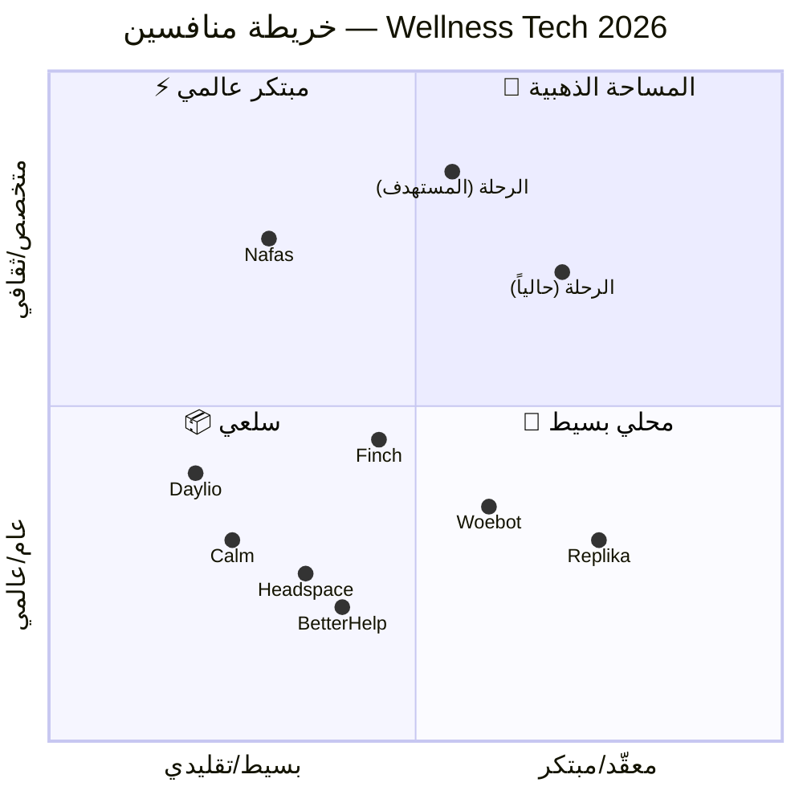
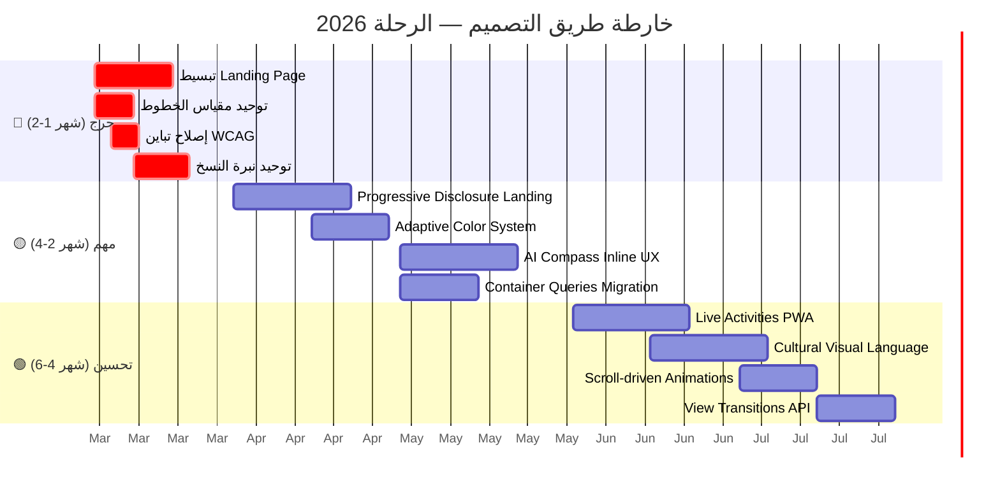

# 🔬 تحليل اتجاهات التصميم 2026 — Wellness Tech & Mental Health SaaS
**المُحلّل:** باحث تصميم (frog Design Standards)
**القطاع:** تكنولوجيا الصحة النفسية والعافية (Wellness Tech)
**التاريخ:** مارس 2026

---

## 1. الاتجاهات الخمسة الكبرى

---

### 🌊 الاتجاه 1: Ambient Intelligence UI — الذكاء المحيطي

**التعريف:** واجهات تتكيّف تلقائيًا مع حالة المستخدم العاطفية والسياقية بدون إدخال يدوي — تستخدم إشارات مثل الوقت، النمط السلوكي، معدّل التفاعل، وبيانات الأجهزة القابلة للارتداء.

**الوصف البصري:**
- ألوان الخلفية تتحوّل تدريجيًا حسب الحالة (هادئ → دافئ عند التوتر)
- مسافات بيضاء تتوسّع/تنكمش ديناميكيًا
- عناصر UI تتلاشى أو تظهر بناءً على السياق
- حركة بطيئة وتنفّسية (80-120ms easing)

**الأصل:** تطوّر من Dynamic Island في iOS وAmbient Mode في Android، مدفوعًا بنماذج AI المحليّة (on-device LLMs) في 2025.

**مرحلة التبنّي:** Early Majority — 30-40% من تطبيقات الصحة النفسية الكبرى تتبنّاه.

**3 علامات تجارية:**
| العلامة | التطبيق | الملاحظة |
|---------|---------|---------|
| **Apple Health** | Mood Journal في iOS 19 | تحويل ألوان الواجهة بناءً على المزاج المسجّل |
| **Calm** | Adaptive Soundscapes 2026 | المحتوى يتكيّف مع بيانات Apple Watch |
| **Woebot Health** | Contextual UI v3 | شدة التفاعل تتغيّر حسب تقييم الحالة |

**المخاطر:** Creepy factor — المستخدم قد يشعر بالمراقبة. نقص الشفافية في كيفية اتخاذ القرارات.
**الفرص لـ الرحلة:** نظام Pulse الحالي يمتلك البنية التحتية (mood tracking + scarcity signals). إضافة adaptive background gradients بناءً على Pulse score.

---

### 🫧 الاتجاه 2: Emotional Glassmorphism — الزجاج العاطفي

**التعريف:** تطوّر glassmorphism التقليدي ليصبح responsive عاطفيًا — الشفافية والـ blur والألوان تتغيّر لتعكس الحالة النفسية بدلاً من أن تكون ثابتة.

**الوصف البصري:**
- طبقات زجاجية بألوان سيمانتيكية (أخضر = آمن، برتقالي = حذر)
- blur يزداد عند عرض محتوى حساس (خصوصية بصرية)
- حدود تنبض بلطف (pulse borders) لجذب الانتباه بدون إزعاج
- إسقاطات ضوئية (light leaks) خلف البطاقات

**الأصل:** بدأ مع visionOS في 2024، تطوّر ليشمل semantic meaning في 2025-2026.

**مرحلة التبنّي:** Early Adopters — 15-20% فقط. معظم التطبيقات ما زالت تستخدم glassmorphism ثابت.

**3 علامات تجارية:**
| العلامة | التطبيق | الملاحظة |
|---------|---------|---------|
| **Headspace** | Mindful UI 2026 | بطاقات زجاجية تتغيّر ألوانها مع نهاية الجلسة |
| **Figma** | FigJam Mood Boards | خلفيات زجاجية بألوان العلامة التجارية |
| **Linear** | Issue Tracker v4 | glass overlays بألوان priority |

**المخاطر:** أداء GPU عالٍ. ضعف الوصولية (contrast) إذا لم يُدار بعناية.
**الفرص لـ الرحلة:** النظام الحالي يستخدم glassmorphism ثابت — ترقية `--glass-bg` ليصبح dynamic بناءً على Ring zone.

---

### 🎯 الاتجاه 3: Single-Purpose Screens — شاشات الغرض الواحد

**التعريف:** بدلاً من صفحات مكتظة بالمعلومات، تتجه التطبيقات نحو "شاشة واحدة = مهمة واحدة" — مستوحاة من فلسفة Focus Mode في macOS.

**الوصف البصري:**
- شاشة واحدة بها CTA واحد فقط
- المحتوى يظهر تراكميًا (progressive disclosure)
- Navigation يختفي خلال المهام
- الفراغات (negative space) تشكّل 40-60% من الشاشة

**الأصل:** رد فعل على "Feature Overload" في 2024-2025، مدعوم بأبحاث NNGroup حول cognitive load.

**مرحلة التبنّي:** Early Majority — 35% من التطبيقات الجديدة في الصحة النفسية.

**3 علامات تجارية:**
| العلامة | التطبيق | الملاحظة |
|---------|---------|---------|
| **Daylio** | Journal v6 | شاشة واحدة = تسجيل مزاج واحد |
| **Finch** | Self-Care Pet 2026 | كل تفاعل في شاشة مستقلة |
| **Notion Calendar** | Quick Entry | نافذة واحدة = حدث واحد بدون menu bars |

**المخاطر:** قد يبدو التطبيق "بسيطًا جدًا" للمستخدمين المتقدمين.
**الفرص لـ الرحلة:** تحويل Landing من 12 قسمًا إلى تجربة progressive disclosure بـ 4-5 شاشات.

---

### 🤖 الاتجاه 4: AI-Native Interfaces — واجهات أصيلة الذكاء الاصطناعي

**التعريف:** واجهات صُمّمت من الصفر حول قدرات AI بدلاً من إضافة AI كميّزة ثانوية — المحادثة والتوليد والتكيّف جزء من البنية الأساسية.

**الوصف البصري:**
- نتائج مولّدة تظهر مباشرة في سياق المهمة (inline generation)
- شريط أوامر (Command Bar) يحل محل القوائم التقليدية
- واجهات "canvas" مفتوحة بدلاً من forms صارمة
- مؤشرات شفافية AI (يوضّح للمستخدم ما يعرفه النظام)

**الأصل:** انفجار LLMs في 2023-2024 → نضج في 2025 → تصميم أصيل في 2026.

**مرحلة التبنّي:** Innovators/Early Adopters — 10-15%. معظم التطبيقات ما زالت تُلصق chatbot.

**3 علامات تجارية:**
| العلامة | التطبيق | الملاحظة |
|---------|---------|---------|
| **Anthropic** | Claude.ai Projects | الملفات + السياق + المحادثة في مساحة واحدة |
| **Perplexity** | Answer Engine | نتائج مولّدة بمصادر مباشرة |
| **Replika** | Emotional AI 2026 | محادثات تكيّفية مع UI يتغيّر حسب المحتوى |

**المخاطر:** Trust deficit — المستخدمون لا يثقون في AI للقرارات النفسية الحساسة.
**الفرص لـ الرحلة:** بوصلة التوجيه الحالية يمكن ترقيتها لتكون AI-native — تحليل inline بدلاً من نتائج في pop-up.

---

### 🌍 الاتجاه 5: Culturally-Tuned Design — التصميم المضبوط ثقافيًا

**التعريف:** تجاوز الترجمة (localization) نحو تصميم مُعاد هندسته ثقافيًا — أنماط تفاعل، استعارات بصرية، ونبرة مُضبوطة للسياق الثقافي المحلي.

**الوصف البصري:**
- RTL أصلي (ليس مجرد mirroring — بل تدفّق بصري مختلف)
- استعارات بصرية مستوحاة من الثقافة المحلية
- أنماط تنقّل مختلفة (Bottom Tabs أكثر شيوعًا في MENA)
- خطوط مصمّمة للغة بدلاً من الترجمة

**الأصل:** توسّع سوق MENA Tech (تضاعف في 2024-2026) + إصدارات عربية أصلية من تطبيقات كبرى.

**مرحلة التبنّي:** Early Majority في MENA — لكن Late Majority عالميًا.

**3 علامات تجارية:**
| العلامة | التطبيق | الملاحظة |
|---------|---------|---------|
| **Careem** | Super App MENA | تصميم أصيل عربي مع أيقونات ثقافية |
| **Nafas** | Arabic Meditation | تجربة تأمل بلغة عربية أصيلة (ليست ترجمة) |
| **Halan** | Egyptian Fintech | واجهة بعامية مصرية مع أنماط تفاعل محلية |

**المخاطر:** Scope creep — دعم لغات/ثقافات متعددة يزيد التعقيد.
**الفرص لـ الرحلة:** المشروع مبنيّ أصلاً بالعربية وهذا ميزة تنافسية ضخمة. تعميق الهوية الثقافية بدلاً من محاكاة تطبيقات إنجليزية.

---

## 2. خريطة المنافسين 2×2



### فرص المساحات البيضاء (White Space)

| المساحة | الوصف | المنافسون | فرصة الرحلة |
|---------|-------|----------|-------------|
| **🎯 متخصص ثقافي + بسيط** | تطبيق عربي بسيط للصحة النفسية بدون تعقيد | شبه فارغة (Nafas فقط) | **ضخمة** — تبسيط Landing + تعزيز الهوية العربية |
| **⚡ مبتكر + متخصص** | AI-native + ثقافي عربي أصيل | فارغة تمامًا | الموقع الحالي — لكن يحتاج تبسيط |
| **🤖 AI therapy عربي** | Woebot/Replika بالعربية | معدوم | ميزة بوصلة التوجيه + Gemini Agent |

---

## 3. تحوّلات توقعات المستخدم

| البُعد | 2024 | 2026 | التأثير على الرحلة |
|--------|------|------|-------------------|
| **الخصوصية** | "أقبل الشروط" | "أريد أن أرى بياناتي وأحذفها فورًا" | إضافة Data Dashboard واضح |
| **سرعة القيمة** | "5 دقائق للبدء" | "30 ثانية أو أغادر" | Hero → CTA مباشر بدون حواجز |
| **الثقة في AI** | "AI ذكي لكن مخيف" | "AI مقبول إذا شفّاف" | إظهار مصادر قرارات البوصلة |
| **التخصيص** | "اختار من قائمة" | "النظام يعرفني" | Adaptive UI بناءً على Pulse history |
| **اللغة** | "ترجمة مقبولة" | "أريد تطبيقًا يتحدث بلغتي أصلاً" | ميزة قائمة — تعزيزها أكثر |
| **الحمل المعرفي** | "الأكثر ميزات = الأفضل" | "الأقل = الأوضح = الأفضل" | تقليص الأقسام من 12 → 5 |

---

## 4. تطوّر المنصات

### iOS 19 (WWDC 2026 Preview)
| التغيير | التأثير على التصميم |
|---------|-------------------|
| **Adaptive Color System** | ألوان تتكيّف مع accessibility preferences تلقائيًا |
| **Live Activities v3** | عرض حالة Pulse على شاشة القفل |
| **Focus Filters** | تخصيص أي تطبيق ليتوافق مع وضع التركيز |
| **HealthKit Emotions API** | ربط بيانات المزاج بين التطبيقات |

### Material You 2026 (Android 16)
| التغيير | التأثير على التصميم |
|---------|-------------------|
| **Expressive Themes** | ألوان ديناميكية أكثر تنوعًا من Monet |
| **Predictive Back Gesture** | تصميم transitions أكثر سلاسة |
| **Health Connect v3** | مشاركة بيانات المزاج بين التطبيقات |

### Web Platform 2026
| التغيير | التأثير على التصميم |
|---------|-------------------|
| **View Transitions API** | Animations بين الصفحات بدون JavaScript |
| **CSS `color-mix()` Level 2** | ألوان ديناميكية في CSS — الرحلة تستخدمه بالفعل ✅ |
| **Scroll-driven animations** | تأثيرات parallax بدون JS |
| **`:has()` Selector** | تصميمات تكيّفيّة بـ CSS فقط |
| **Container Queries** | مكونات متجاوبة حقيقية (بدلاً من breakpoints) |

---

## 5. التوصيات الاستراتيجية

### الاستراتيجية المقترحة: "Innovation with Restraint"

> ابتكار مقيّد — ابتكر في القيمة الأساسية لا في الواجهة.

| التوصية | الأولوية | المبدأ |
|---------|----------|-------|
| **1. تبنّي Single-Purpose Screens** | 🔴 فوري | تحويل Landing من 12 قسم → 5 شاشات progressive |
| **2. توحيد الهوية اللغوية** | 🔴 فوري | اختيار نبرة "هادئة واعية" بدلاً من عسكرية |
| **3. إضافة Ambient Color Adaptation** | 🟡 Q2 | ربط gradients بمؤشر Pulse |
| **4. ترقية AI Integration** | 🟡 Q2 | بوصلة توجيه inline بدلاً من chatbot |
| **5. تعميق الضبط الثقافي** | 🟢 Q3 | استعارات بصرية عربية أصيلة + خط مخصص |
| **6. دعم Live Activities** | 🟢 Q3 | Pulse widget على شاشة القفل (PWA) |

---

## 6. خارطة طريق 6 أشهر



---

## 7. مواصفات Moodboard

### 🎨 لوحة الألوان المقترحة 2026

```
┌──────────────────────────────────────────────────────────┐
│  PRIMARY PALETTE — الهدوء الواعي                          │
│                                                          │
│  ████ #0C1220  Void (خلفية أساسية)                       │
│  ████ #151D33  Deep (سطح ثانوي)                          │
│  ████ #2dd4bf  Teal 400 (Brand primary — إبقاء)          │
│  ████ #5eead4  Teal 300 (تركيز خفيف)                     │
│  ████ #f5a623  Amber 500 (CTA — إبقاء)                   │
│  ████ #fbbf24  Amber 400 (CTA hover)                     │
│                                                          │
│  NEUTRAL PALETTE — النص                                   │
│                                                          │
│  ████ #f1f5f9  Slate 100 (نص رئيسي — إبقاء)             │
│  ████ #cbd5e1  Slate 300 (نص ثانوي — ترقية من 400)       │
│  ████ #94a3b8  Slate 400 (نص تلميحي — فقط على سطوح)     │
│                                                          │
│  SEMANTIC PALETTE — الحالة                                │
│                                                          │
│  ████ #10b981  Emerald (آمن/نجاح)                        │
│  ████ #f59e0b  Amber (تحذير/حذر)                         │
│  ████ #ef4444  Red 500 (خطر — بدلاً من rose)              │
│  ████ #8b5cf6  Violet (إبداعي/استكشاف)                   │
└──────────────────────────────────────────────────────────┘
```

### ✏️ نظام الخطوط المقترح

```
┌──────────────────────────────────────────────────────────┐
│  TYPOGRAPHIC SCALE — 4 أحجام فقط                          │
│                                                          │
│  Display:  clamp(2rem, 5vw, 3.5rem)  — العناوين الكبرى   │
│  Heading:  clamp(1.25rem, 2.5vw, 1.75rem) — عناوين فرعية │
│  Body:     1rem (16px) — النص الأساسي                     │
│  Caption:  0.875rem (14px) — تلميحات (الحد الأدنى المطلق) │
│                                                          │
│  ❌ ممنوع: أي نص أقل من 14px                              │
│  ❌ ممنوع: أحجام عشوائية (10px, 11px, 13px)              │
│                                                          │
│  FONT STACK                                              │
│  Display: "Almarai", system-ui                           │
│  Body: "IBM Plex Sans Arabic", "Almarai", system-ui      │
│  Mono: "IBM Plex Mono", monospace                        │
│                                                          │
│  WEIGHT SCALE                                            │
│  Regular: 400 (body)                                     │
│  Semibold: 600 (emphasized body)                         │
│  Bold: 700 (headings)                                    │
│  Black: 900 (display only — hero titles)                 │
│                                                          │
│  ❌ ممنوع: font-black على نص أصغر من heading             │
└──────────────────────────────────────────────────────────┘
```

### 🖼️ توجيهات بصرية

| العنصر | 2025 (الحالي) | 2026 (المقترح) |
|--------|-------------|---------------|
| **الخلفية** | Static gradient + particles | Adaptive gradient يتغيّر مع Pulse |
| **البطاقات** | Static glassmorphism | Emotional glass بألوان سيمانتيكية |
| **الحركة** | Stagger + fadeUp (كثيفة) | Minimal: fadeUp فقط للعناوين (70% أقل) |
| **الأيقونات** | Lucide Icons (outline) | إبقاء + إضافة custom icons للميّزات الأساسية |
| **الصور** | لا توجد | إضافة 1-2 illustration مخصصة (abstract wellness) |
| **الفيديو** | لا يوجد | Hero video/animation (15 ثانية) |
| **المسافات** | Phi system (φ) | إبقاء — نقطة قوة فريدة |
| **Radius** | متعدد (0.5-2.5rem) | توحيد: 1rem (base) + 1.5rem (card) + full (pill) |

### 🎭 النبرة البصرية المقترحة

> **"حضور هادئ. وضوح كامل. بلا ضوضاء."**

- مستوحاة من: Apple Health + Headspace + Linear
- الإحساس: كأنك تدخل غرفة مضاءة بنور طبيعي هادئ
- ليس: مركبة فضائية، قاعدة عسكرية، أو لوحة قيادة معقّدة
- الكلمات المفتاحية: **وضوح، أمان، بساطة، ثقة، خصوصية**

---

## 📊 ملخص تنفيذي

| المحور | الحالة الحالية | الاتجاه 2026 | الأولوية |
|--------|-------------|-------------|----------|
| Ambient UI | ❌ غير موجود | 🌊 ربط الواجهة بـ Pulse | 🟡 Q2 |
| Emotional Glass | ⚠️ Static glass | 🫧 Semantic glass | 🟢 Q3 |
| Single-Purpose | ❌ 12 قسم مكدّس | 🎯 5 شاشات focused | 🔴 فوري |
| AI-Native | ⚠️ Chatbot overlay | 🤖 Inline compass | 🟡 Q2 |
| Cultural Design | ✅ عربي أصلي | 🌍 تعميق ثقافي | 🟢 Q3 |

> **الخلاصة:** الرحلة تملك أساسًا تقنيًا متقدمًا (Phi system, adaptive performance, A/B testing, Arabic-first) — وهذا يضعها في موقع فريد. المطلوب الآن هو **تقليص** لا **إضافة**: تبسيط الـ Landing، توحيد النبرة، ورفع مستوى الوصولية. الاتجاهات الخمسة الكبرى كلها تصبّ في نفس الاتجاه: **أقل ضوضاء، أكثر وضوحًا**.
