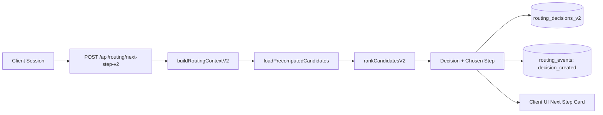
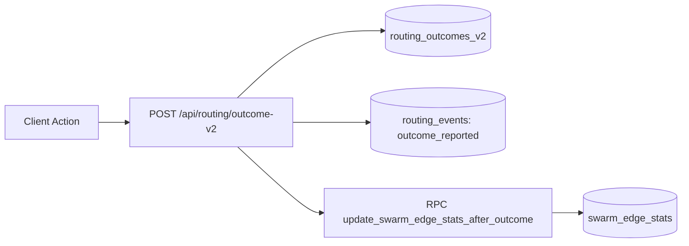
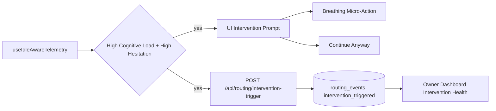
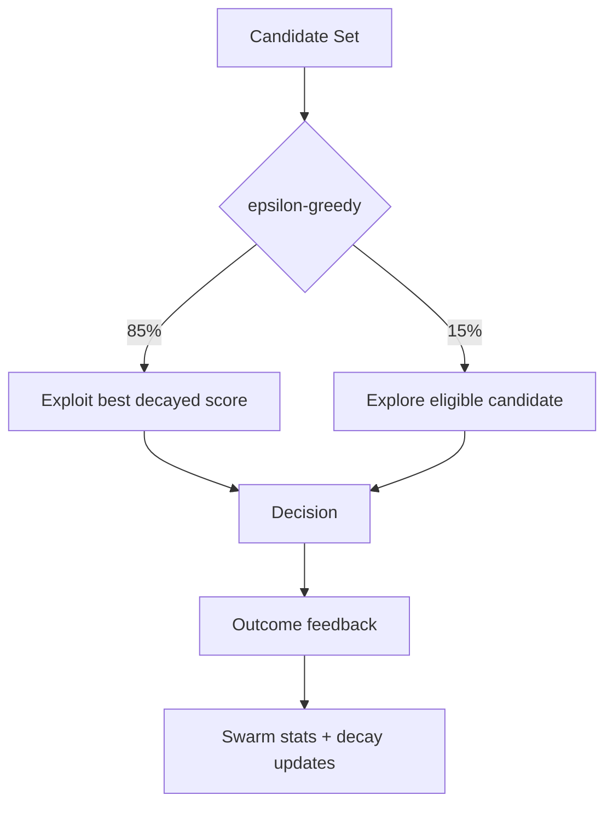
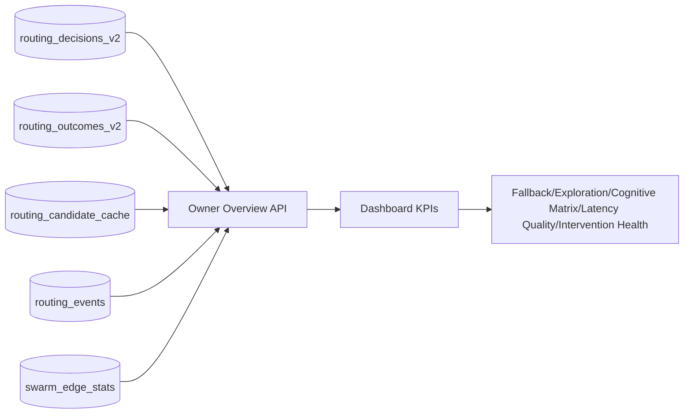
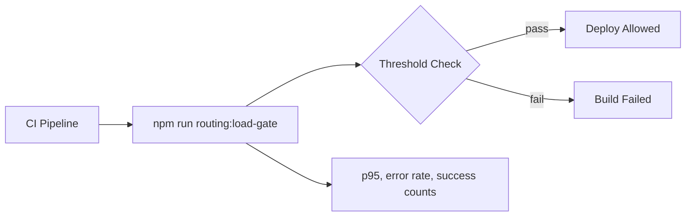

# Dynamic Routing Architecture (Mermaid)

## 1) Runtime Decision Flow


## 2) Outcome + Swarm Learning Flow


## 3) Active Intervention Flow


## 4) Precompute and Cache Pipeline


## 5) Exploration/Exploitation Guardrail


## 6) Observability Model


## 7) Load Gate in CI


## Suggested README Snippet
```md
### Dynamic Routing Architecture
See: `docs/DYNAMIC_ROUTING_ARCHITECTURE.md`
See: `docs/TECHNICAL_PITCH_DECK.md`
```

