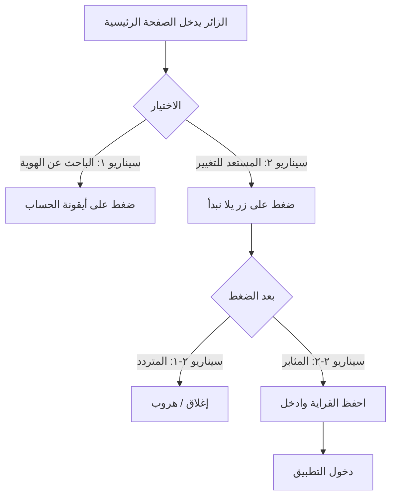

# خريطة تدفق الزائر (Visitor Flow Map)

## البداية: شاشة الهبوط (Landing)

```
                         ┌─────────────────────┐
                         │   الزائر يدخل       │
                         │   الصفحة الرئيسية   │
                         └──────────┬──────────┘
                                    │
                    ┌───────────────┴───────────────┐
                    │                               │
                    ▼                               ▼
        ┌───────────────────────┐       ┌───────────────────────┐
        │  سيناريو ١            │       │  سيناريو ٢            │
        │  الباحث عن الهوية     │       │  المستعد للتغيير       │
        │  ضغط على أيقونة       │       │  ضغط على زر           │
        │  الحساب (Profile)     │       │  «يلا نبدأ»           │
        └───────────────────────┘       └───────────┬───────────┘
                                                    │
                                    ┌───────────────┴───────────────┐
                                    │                               │
                                    ▼                               ▼
                        ┌───────────────────────┐       ┌───────────────────────┐
                        │  سيناريو ٢-١          │       │  سيناريو ٢-٢          │
                        │  المتردد              │       │  المثابر              │
                        │  إغلاق قبل الإكمال   │       │  احفظ القراية وادخل   │
                        └───────────────────────┘       └───────────────────────┘
```

---

## مخطط Mermaid (للعرض في GitHub / VS Code)



---

## جدول السيناريوهات

| السيناريو | المسمى | السلوك | الحدث المسجّل |
|-----------|--------|--------|----------------|
| ١ | الباحث عن الهوية | ضغط أيقونة الحساب | `profile_clicked` |
| ٢ | المستعد للتغيير | ضغط يلا نبدأ | `landing_clicked_start` |
| ٢-١ | المتردد | إغلاق قبل الإكمال | `pulse_abandoned` |
| ٢-٢ | المثابر | احفظ القراية وادخل | `pulse_completed` |
